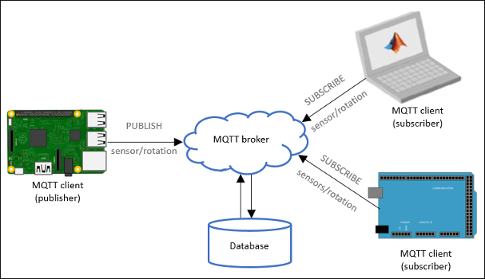

# Installation

## Install paho-mqtt
```bash
  vitualenv paho-mqtt
  source paho-mqtt/bin/activate
  pip3 install paho-mqtt
```

## Install requirements
```bash
  pip3 install -r requirements.txt
```

## Create db init
```bash
  python3 db/db_init.py
  python3 db/show_tables.py
```

# MQTT Architecture


# Example: Video Record
